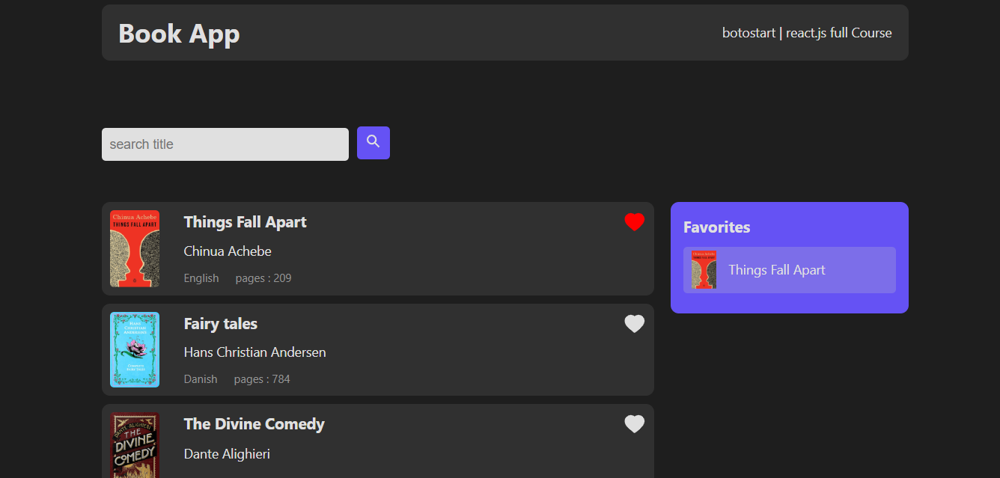

📚 Book Library

A simple and useful project for managing books with features like searching and liking books.

✨ Features

🔎 Search books by title or author

❤️ Like books to add them to your favorites

📂 Simple, clean, and extendable design

🛠️ Tech Stack

Framework/Language: (html,css,javaScript,Reactjs)

🚀 Getting Started
1. Clone the repository
git clone https://github.com/H-ooman/Book-App.git

2. Install dependencies
npm install

or

pip install -r requirements.txt

3. Run the project
npm run dev

📷 Preview

🤝 Contributing

Contributions, issues, and feature requests are welcome!
For major changes, please open an issue first to discuss what you’d like to change.

📄 License

This project is licensed under the MIT License.